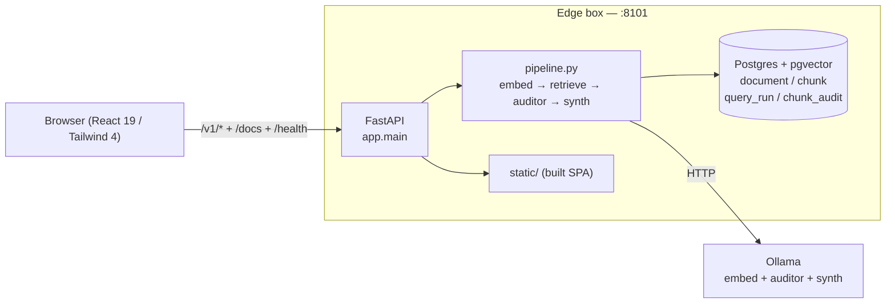
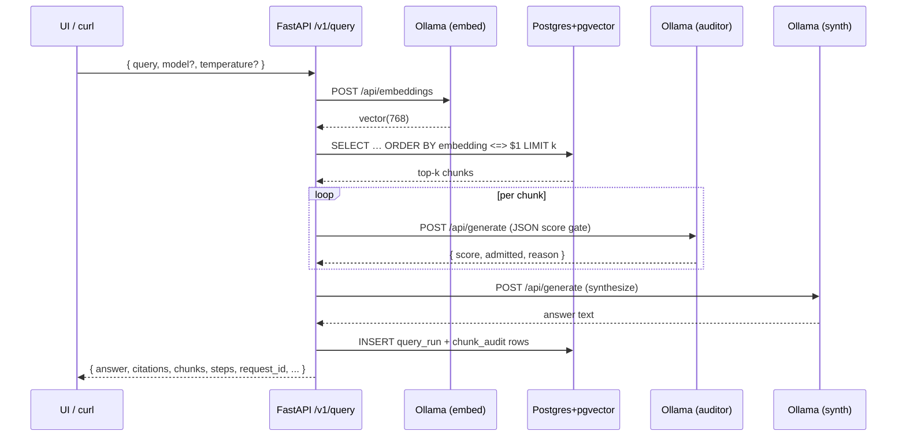
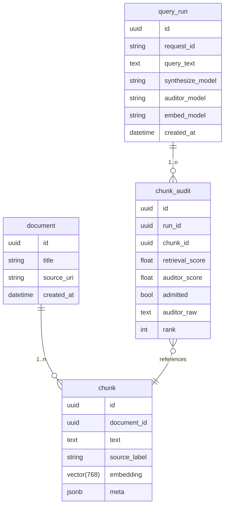

# AuditShield — architecture

Single-service FastAPI app with a Vite SPA built into `static/`. State lives in
Postgres + pgvector. LLM calls are local to Ollama. Nothing leaves the edge.

## Component diagram

## Request flow — `POST /v1/query`

## Streaming (`/v1/query/stream`)

Same pipeline, but emits `start → step(embed) → step(retrieve) → step(auditor) → step(synth) → done(result)` as SSE so the UI can render progress incrementally.

## Audit ledger model

`GET /v1/audit-trail` joins `query_run` + `chunk_audit` to produce an exportable
governance view.

## Frontend

- React 19 + TanStack Query + react-hook-form + Zod
- Tailwind 4 with the **Compliance Ledger** theme (parchment, navy, oxblood seal,
  gold-leaf rule). Fonts: Fraunces (display), Inter (UI), JetBrains Mono (IDs).
- Framer Motion respects `prefers-reduced-motion`; skip-link + visible focus
  rings satisfy WCAG 2.4.1 / 2.4.7.

## Deployment

Single image (`Dockerfile`) builds the SPA, copies `web/dist` to `static/`, runs
`uvicorn app.main:app --host 0.0.0.0 --port 8101`. `docker-compose.yml` ships
the Postgres+pgvector dependency.

## Failure modes (deliberate)

| Condition | Behaviour |
|---|---|
| `DATABASE_URL` unset | `/v1/query` and ingest endpoints return **503** (no stub) |
| Ollama unreachable | `502` with hint about embed model |
| Empty corpus | `200` with "no admitted chunks" answer + empty arrays |
